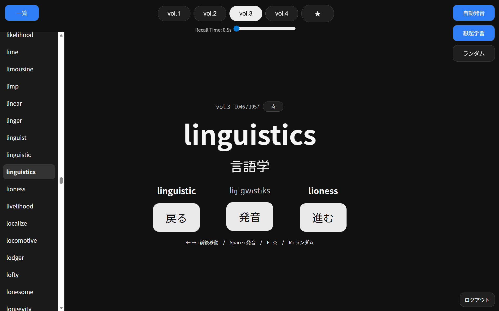

# English Vocabulary App

A web-based vocabulary learning app focused on recall-based learning and efficient review.

## Screenshots

## Demo

👉 https://rementia.github.io/vocab-app/

---

## Overview

This app focuses on **recall-based learning**, rather than simple memorization, to improve long-term retention of English vocabulary.

Users practice recalling meanings within a short time, and efficiently review words using features such as favorites and multiple learning modes.

---

## Features

* Level-based learning (vol.1–4)
* Random mode
* Favorite word management (★)
* Pronunciation feature
* Recall mode (time-limited)
* Responsive design (mobile support)

---

## Technologies

* HTML
* CSS
* JavaScript
* GitHub Pages

---

## Usage

1. Select a level (vol.1–4)
2. Try to recall the meaning within a short time
3. Available controls:

   * `← →` : Navigate words
   * `Space` : Pronounce
   * `F` : Toggle favorite
4. Use random mode or favorites for efficient review

---

## Key Design Ideas

This app is designed with the following principles:

* Treat vocabulary as **connected meanings rather than isolated translations**
* Improve retention through **spaced recall**
* Enable efficient review by identifying and focusing on difficult words

---

## Future Improvements

* Improve UI for landscape mode on mobile
* Enhance progress tracking
* Improve random mode behavior
* Strengthen data persistence features

---

## Author

Anonymous
